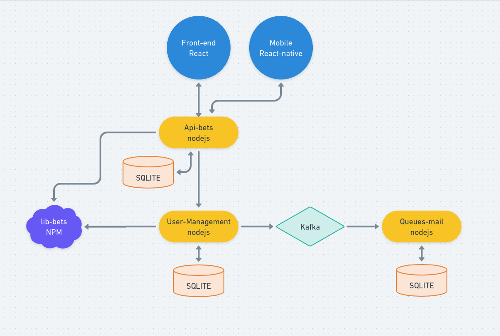

# TS - SOLID

## This is it

This is a initial server with typescript using SOLID
  - typescript
  - jest
  - babel
  - eslint

## How to start?

  i'm using yarn, but you can use npm run

  - yarn install / npm install
  - yarn build - to create on ./dist the compiled version
  - yarn prod - to execute pm2 with production 
  - yar dev - to execute as a development

## About the project

  It is a micro-service project, this is the user-management
  The user-management is a CRUD to user, all applications will consume the uses registered here

## Projects
  - Queues - https://github.com/johnnymoreira91/services-microservice-plan

  